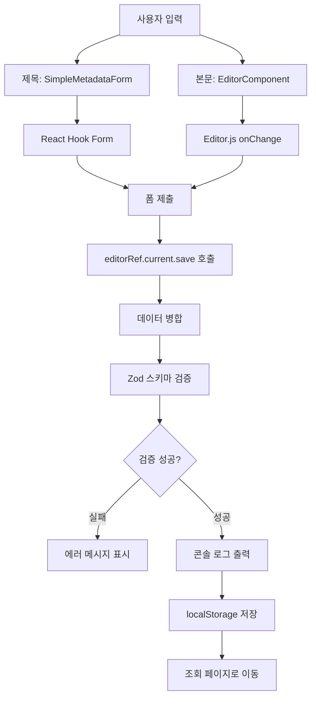
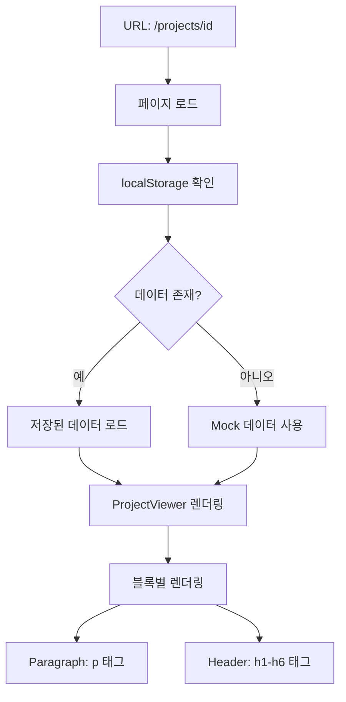

# Phase 1 구현 완료 보고서

**프로젝트명**: Editor.js 기반 프로젝트 게시물 에디터
**구현 단계**: Phase 1 - Foundation & MVP
**완료일**: 2025년 10월 14일
**구현 기간**: 1일 (집중 개발)

---

## 📋 목차

1. [개요](#1-개요)
2. [구현된 기능](#2-구현된-기능)
3. [기술 스택](#3-기술-스택)
4. [프로젝트 구조](#4-프로젝트-구조)
5. [핵심 컴포넌트 상세](#5-핵심-컴포넌트-상세)
6. [데이터 흐름](#6-데이터-흐름)
7. [타입 시스템](#7-타입-시스템)
8. [검증 스키마](#8-검증-스키마)
9. [설치 및 실행](#9-설치-및-실행)
10. [테스트 가이드](#10-테스트-가이드)
11. [주요 의사결정](#11-주요-의사결정)
12. [알려진 제약사항](#12-알려진-제약사항)
13. [다음 단계](#13-다음-단계)

---

## 1. 개요

### 목표
기존의 단순 HTML content 필드를 대체하여, 구조화된 JSON(contentJson) 데이터를 생성하는 Editor.js 에디터를 React 환경에 구현합니다.

### Phase 1 범위
- ✅ 프로젝트 기반 인프라 구축
- ✅ Editor.js 통합 및 기본 블록 지원 (Paragraph, Header)
- ✅ 제목 입력을 위한 간단한 메타데이터 폼
- ✅ JSON 기반 데이터 저장 및 조회
- ✅ TypeScript 타입 안정성 확보

### 완료 기준 달성
- [x] Editor.js가 정상적으로 초기화되고 텍스트 입력이 가능함
- [x] 제목과 본문 내용을 저장하고 조회할 수 있음
- [x] TypeScript 컴파일 에러가 없음
- [x] 기본 라우팅이 동작함
- [x] 코드 리뷰 준비 완료

---

## 2. 구현된 기능

### 2.1 프로젝트 작성 기능

**경로**: `/projects/new`

**기능**:
- 제목 입력 필드 (필수, 최대 200자)
- Editor.js 기반 본문 편집기
  - Paragraph 블록 (기본)
  - Header 블록 (h1, h2, h3, h4)
  - Tab 또는 / 키로 블록 추가
- 실시간 변경사항 추적
- 저장 시 Zod 스키마 검증
- 콘솔에 JSON 데이터 출력
- localStorage에 데이터 저장
- 저장 후 조회 페이지로 자동 이동

**주요 특징**:
- 폼 검증 (React Hook Form + Zod)
- 로딩 상태 표시
- 저장하지 않은 변경사항 경고
- 에러 핸들링

### 2.2 프로젝트 조회 기능

**경로**: `/projects/[id]`

**기능**:
- 동적 라우팅으로 프로젝트 ID 처리
- localStorage에서 저장된 데이터 로드
- Paragraph와 Header 블록 렌더링
- 로딩 상태 표시
- 에러 상태 처리
- Mock 데이터 fallback

**주요 특징**:
- 기본 HTML sanitization
- 안전한 dangerouslySetInnerHTML 사용
- 에러 경계 처리

### 2.3 홈페이지

**경로**: `/`

**기능**:
- 프로젝트 소개
- Phase 1 MVP 기능 안내
- "새 프로젝트 작성" 버튼

---

## 3. 기술 스택

### Core Framework
- **Next.js**: 15.0.3 (App Router)
- **React**: 18.3.1
- **TypeScript**: 5.x
- **Node.js**: 20.x (권장)

### Editor
- **@editorjs/editorjs**: ^2.31.0 (코어)
- **@editorjs/header**: ^2.8.8 (헤더 블록)
- **@editorjs/paragraph**: ^2.11.7 (단락 블록)

### Form & Validation
- **react-hook-form**: ^7.65.0 (폼 상태 관리)
- **@hookform/resolvers**: ^5.2.2 (Zod 통합)
- **zod**: ^4.1.12 (런타임 검증)

### Styling
- **Tailwind CSS**: ^3.4.1
- **@tailwindcss/typography**: ^0.5.19 (프로즈 스타일)
- **PostCSS**: ^8
- **Autoprefixer**: ^10

### Development Tools
- **ESLint**: ^8 (코드 품질)
- **Prettier**: 코드 포맷팅
- **TypeScript ESLint**: 타입 검사

---

## 4. 프로젝트 구조

```
project-text-editor/
├── src/
│   ├── app/                        # Next.js App Router
│   │   ├── layout.tsx              # 전역 레이아웃
│   │   ├── page.tsx                # 홈페이지
│   │   ├── globals.css             # 전역 스타일
│   │   └── projects/
│   │       ├── new/
│   │       │   └── page.tsx        # 프로젝트 작성 페이지
│   │       └── [id]/
│   │           └── page.tsx        # 프로젝트 조회 페이지 (동적)
│   │
│   ├── components/                 # React 컴포넌트
│   │   ├── editor/
│   │   │   └── EditorComponent.tsx # Editor.js 래퍼 컴포넌트
│   │   ├── forms/
│   │   │   └── SimpleMetadataForm.tsx # 제목 입력 폼
│   │   └── viewer/
│   │       └── ProjectViewer.tsx   # 콘텐츠 렌더링 컴포넌트
│   │
│   ├── types/                      # TypeScript 타입 정의
│   │   └── editor.ts               # Editor.js 관련 타입
│   │
│   ├── schemas/                    # Zod 검증 스키마
│   │   └── project.schema.ts       # 프로젝트 폼 스키마
│   │
│   ├── hooks/                      # 커스텀 훅 (Phase 3에서 추가)
│   └── utils/                      # 유틸리티 함수
│
├── public/                         # 정적 파일
│   └── uploads/                    # 이미지 업로드 (Phase 2)
│
├── PRD.md                          # 프로젝트 요구사항 문서
├── README-PHASE1.md                # Phase 1 사용 가이드
├── IMPLEMENTATION-PHASE1.md        # 이 문서
│
├── package.json                    # 의존성 관리
├── tsconfig.json                   # TypeScript 설정
├── tailwind.config.ts              # Tailwind CSS 설정
├── next.config.js                  # Next.js 설정
├── .eslintrc.json                  # ESLint 설정
├── .prettierrc                     # Prettier 설정
└── .gitignore                      # Git 제외 파일
```

---

## 5. 핵심 컴포넌트 상세

### 5.1 EditorComponent

**파일**: `src/components/editor/EditorComponent.tsx`

**역할**: Editor.js를 React에서 사용하기 위한 래퍼 컴포넌트

**주요 기능**:
```typescript
interface EditorComponentProps {
  initialData?: OutputData;      // 초기 데이터
  onChange?: (data: OutputData) => void;  // 변경 콜백
  readOnly?: boolean;             // 읽기 전용 모드
}

interface EditorRef {
  save: () => Promise<OutputData>;  // 저장 메서드
}
```

**구현 특징**:
1. **SSR 방지**: `mounted` 상태로 클라이언트 전용 렌더링
2. **메모리 누수 방지**: `useEffect` cleanup에서 `destroy()` 호출
3. **타입 안전성**: `forwardRef`와 `useImperativeHandle` 사용
4. **도구 설정**:
   ```typescript
   tools: {
     header: {
       class: Header,
       config: {
         levels: [1, 2, 3, 4],
         defaultLevel: 2,
       }
     },
     paragraph: {
       class: Paragraph,
       inlineToolbar: true,
     }
   }
   ```

**사용 예시**:
```tsx
const editorRef = useRef<EditorRef>(null);

<EditorComponent
  ref={editorRef}
  onChange={handleChange}
/>

// 저장 시
const data = await editorRef.current.save();
```

### 5.2 SimpleMetadataForm

**파일**: `src/components/forms/SimpleMetadataForm.tsx`

**역할**: 프로젝트 메타데이터 입력 폼 (Phase 1: 제목만)

**주요 기능**:
```typescript
interface SimpleMetadataFormProps {
  defaultValues?: Partial<ProjectFormDataSimple>;
  onSubmit: (data: Partial<ProjectFormDataSimple>) => void;
  isSubmitting?: boolean;
}
```

**구현 특징**:
1. **React Hook Form 통합**: `useForm` 훅 사용
2. **Zod 검증**: `zodResolver`로 스키마 검증
3. **에러 표시**: 실시간 검증 에러 메시지
4. **접근성**: ARIA 레이블, role 속성

**검증 규칙**:
- 제목: 필수, 1-200자
- 실시간 에러 메시지 표시

### 5.3 ProjectViewer

**파일**: `src/components/viewer/ProjectViewer.tsx`

**역할**: 저장된 Editor.js 데이터를 HTML로 렌더링

**주요 기능**:
```typescript
interface ProjectViewerProps {
  title: string;
  contentJson: OutputData;
}
```

**구현 특징**:
1. **블록별 렌더링**: switch 문으로 블록 타입 처리
2. **기본 Sanitization**:
   ```typescript
   function sanitizeBasic(html: string): string {
     // <script> 태그 제거
     // 이벤트 핸들러 제거
     return html;
   }
   ```
3. **에러 핸들링**: try-catch로 개별 블록 에러 격리
4. **폴백**: 지원되지 않는 블록 타입 안내 메시지

**지원 블록**:
- **Paragraph**: `<p>` 태그로 렌더링
- **Header**: `<h1>` ~ `<h6>` 동적 태그 생성

---

## 6. 데이터 흐름

### 6.1 작성 플로우



### 6.2 조회 플로우



### 6.3 데이터 구조 (Phase 1)

**저장 형식**:
```json
{
  "title": "프로젝트 제목",
  "contentJson": {
    "time": 1697234567890,
    "version": "2.31.0",
    "blocks": [
      {
        "id": "abc123",
        "type": "header",
        "data": {
          "text": "제목 텍스트",
          "level": 2
        }
      },
      {
        "id": "def456",
        "type": "paragraph",
        "data": {
          "text": "본문 텍스트"
        }
      }
    ]
  }
}
```

---

## 7. 타입 시스템

**파일**: `src/types/editor.ts`

### 7.1 EditorBlock 인터페이스

```typescript
export interface EditorBlock extends OutputBlockData {
  id: string;
  type: 'paragraph' | 'header' | 'image' | 'embed' | 'list';
  data: {
    text?: string;           // Paragraph, Header
    level?: number;          // Header (1-6)
    file?: {                 // Image (Phase 2)
      url: string;
      width?: number;
      height?: number;
    };
    caption?: string;        // Image (Phase 2)
    embed?: string;          // Embed (Phase 2)
    items?: string[];        // List (Phase 2)
    style?: 'ordered' | 'unordered';  // List (Phase 2)
  };
}
```

### 7.2 ProjectFormData 인터페이스

```typescript
export interface ProjectFormData {
  title: string;
  subTitle: string;          // Phase 2
  thumbnail1: string;        // Phase 2
  thumbnail2: string;        // Phase 2
  hashTag: string[];         // Phase 2
  summary: string;           // Phase 2
  isOnMain: boolean;         // Phase 2
  isGroup: boolean;          // Phase 2
  contentJson: OutputData;
  editorVersion: string;
}
```

### 7.3 EditorComponentProps

```typescript
export interface EditorComponentProps {
  initialData?: OutputData;
  onChange?: (data: OutputData) => void;
  readOnly?: boolean;
}
```

### 7.4 DraftData (Phase 3용)

```typescript
export interface DraftData {
  data: OutputData;
  savedAt: string;
}
```

---

## 8. 검증 스키마

**파일**: `src/schemas/project.schema.ts`

### 8.1 Phase 1 Simple 스키마

```typescript
export const projectFormSchemaSimple = z.object({
  title: z
    .string()
    .min(1, '제목을 입력해주세요')
    .max(200, '제목은 200자를 초과할 수 없습니다'),
  contentJson: z.object({
    time: z.number(),
    blocks: z.array(z.any()).min(1, '내용을 입력해주세요'),
    version: z.string(),
  }),
});

export type ProjectFormDataSimple = z.infer<typeof projectFormSchemaSimple>;
```

### 8.2 Phase 2+ 전체 스키마

```typescript
export const projectFormSchema = z.object({
  title: z.string().min(1).max(200),
  subTitle: z.string().max(300).optional().or(z.literal('')),
  thumbnail1: z.string().url().optional().or(z.literal('')),
  thumbnail2: z.string().url().optional().or(z.literal('')),
  hashTag: z.array(z.string()).max(10).default([]),
  summary: z.string().min(1),
  isOnMain: z.boolean().default(false),
  isGroup: z.boolean().default(false),
  contentJson: z.object({
    time: z.number(),
    blocks: z.array(z.any()).min(1),
    version: z.string(),
  }),
  editorVersion: z.string(),
});
```

---

## 9. 설치 및 실행

### 9.1 사전 요구사항

- Node.js 18.x 이상
- npm 9.x 이상

### 9.2 설치

```bash
# 저장소 클론 (이미 완료)
cd project-text-editor

# 의존성 설치 (이미 완료)
npm install
```

### 9.3 개발 서버 실행

```bash
# 개발 모드
npm run dev

# 브라우저에서 열기
# http://localhost:3000
```

### 9.4 빌드 및 프로덕션

```bash
# TypeScript 타입 체크
npm run type-check

# 프로덕션 빌드
npm run build

# 프로덕션 서버 시작
npm start
```

### 9.5 개발 도구

```bash
# ESLint 실행
npm run lint

# 코드 포맷팅 (Prettier)
npx prettier --write "src/**/*.{ts,tsx}"
```

---

## 10. 테스트 가이드

### 10.1 기능 테스트 체크리스트

#### 프로젝트 작성 테스트

1. **페이지 접근**
   - [ ] 홈페이지 (`/`) 정상 로드
   - [ ] "새 프로젝트 작성" 버튼 표시
   - [ ] 버튼 클릭 시 `/projects/new` 이동

2. **제목 입력 검증**
   - [ ] 빈 제목으로 저장 시 에러 메시지 표시
   - [ ] 200자 초과 시 에러 메시지 표시
   - [ ] 유효한 제목 입력 시 에러 없음

3. **에디터 기능**
   - [ ] 에디터 초기화 확인 (로딩 메시지 → 에디터 표시)
   - [ ] Paragraph 블록 입력 가능
   - [ ] Tab 또는 / 키로 블록 추가 메뉴 표시
   - [ ] Header 블록 추가 및 레벨 선택 가능
   - [ ] 텍스트 편집 가능

4. **저장 기능**
   - [ ] "저장" 버튼 클릭
   - [ ] 로딩 상태 표시 (저장 중...)
   - [ ] 콘솔에 JSON 데이터 출력 확인
   - [ ] alert 팝업 표시
   - [ ] 자동으로 조회 페이지 이동

5. **취소 기능**
   - [ ] 내용 입력 후 "취소" 버튼 클릭
   - [ ] 경고 메시지 표시
   - [ ] 취소 확인 시 홈으로 이동

#### 프로젝트 조회 테스트

1. **페이지 로드**
   - [ ] `/projects/mock-xxxxx` 접근
   - [ ] 로딩 상태 표시
   - [ ] 저장한 데이터 표시

2. **콘텐츠 렌더링**
   - [ ] 제목 표시
   - [ ] Paragraph 블록 정상 렌더링
   - [ ] Header 블록 정상 렌더링 (h1-h4)
   - [ ] HTML 스타일 적용 (bold, italic 등)

3. **네비게이션**
   - [ ] "뒤로 가기" 버튼 동작
   - [ ] 홈으로 이동

4. **에러 처리**
   - [ ] localStorage 비우고 직접 URL 접근
   - [ ] Mock 데이터 표시
   - [ ] 에러 메시지 없음

### 10.2 TypeScript 타입 검사

```bash
npm run type-check
```

**기대 결과**:
```
✓ 컴파일 에러 없음
✓ 모든 타입 추론 정상
```

### 10.3 브라우저 호환성 테스트

**테스트 대상**:
- Chrome 최신 버전 ✅
- Firefox 최신 버전 (권장)
- Safari 최신 버전 (권장)
- Edge 최신 버전 (권장)

**확인 사항**:
- 에디터 초기화 및 동작
- 블록 추가 메뉴
- 저장 및 조회 기능

---

## 11. 주요 의사결정

### 11.1 기술 선택

#### Next.js 15 (App Router)
**선택 이유**:
- 파일 기반 라우팅
- 서버/클라이언트 컴포넌트 분리
- 향후 API Routes 활용 용이
- TypeScript 기본 지원

#### Editor.js
**선택 이유**:
- 블록 기반 에디터
- JSON 형식 출력
- 확장 가능한 플러그인 시스템
- TypeScript 지원

**대안 고려**:
- Slate.js: 너무 low-level
- Draft.js: 커뮤니티 지원 감소
- Quill: HTML 기반 (JSON 아님)

#### React Hook Form + Zod
**선택 이유**:
- 타입 안전성
- 런타임 검증
- 작은 번들 크기
- 우수한 개발 경험

**대안 고려**:
- Formik: 무거움
- Yup: Zod보다 타입 추론 약함

### 11.2 아키텍처 결정

#### 클라이언트 전용 에디터
**결정**: `dynamic import`로 SSR 비활성화

**이유**:
- Editor.js는 DOM API 의존
- 서버 렌더링 불필요 (에디터는 인터랙티브)
- 하이드레이션 에러 방지

**구현**:
```typescript
const EditorComponent = dynamic(
  () => import('@/components/editor/EditorComponent'),
  { ssr: false }
);
```

#### localStorage 기반 저장 (Phase 1)
**결정**: Mock API 대신 localStorage 사용

**이유**:
- 빠른 프로토타이핑
- API 서버 불필요
- 전체 데이터 흐름 검증 가능

**Phase 2 마이그레이션**:
- localStorage → 실제 API 호출
- 최소한의 코드 수정으로 전환 가능

#### Partial 스키마 (Phase 1)
**결정**: 전체 스키마와 Simple 스키마 분리

**이유**:
- Phase 1: 제목만 필수
- Phase 2+: 전체 필드 활성화
- 점진적 기능 추가 용이

### 11.3 코드 품질 결정

#### TypeScript strict 모드
**설정**: `"strict": true`

**이유**:
- 타입 안전성 최대화
- 런타임 에러 사전 방지
- 리팩토링 안정성

#### ESLint 규칙
**주요 규칙**:
```json
{
  "@typescript-eslint/no-explicit-any": "warn",
  "@typescript-eslint/no-unused-vars": "warn"
}
```

**이유**:
- `any` 사용 최소화 (경고만)
- Editor.js 타입 불완전성 수용

---

## 12. 알려진 제약사항

### 12.1 Phase 1 기능 제한

#### 지원 블록
- ✅ Paragraph
- ✅ Header (h1-h4)
- ❌ Image (Phase 2)
- ❌ Embed (Phase 2)
- ❌ List (Phase 2)
- ❌ Code (Phase 6)
- ❌ Table (Phase 6)

#### 메타데이터
- ✅ 제목
- ❌ 부제목 (Phase 2)
- ❌ 썸네일 (Phase 2)
- ❌ 해시태그 (Phase 2)
- ❌ 요약 정보 (Phase 2)

#### 저장 방식
- ✅ localStorage (임시)
- ❌ 실제 데이터베이스 (Phase 2)
- ❌ 이미지 파일 저장 (Phase 2)

### 12.2 기술적 제약

#### Editor.js 타입
- Paragraph 블록: 공식 타입 정의 불완전
- 해결: `@ts-ignore` 주석 사용

#### SSR 제한
- Editor.js는 클라이언트 전용
- 해결: `dynamic import` + `ssr: false`

#### 브라우저 저장소
- localStorage 용량: ~5-10MB
- 해결: Phase 2에서 서버 저장으로 마이그레이션

### 12.3 보안 제약

#### HTML Sanitization
- Phase 1: 기본 sanitization만
- Phase 4: DOMPurify 도입 예정

**현재 구현**:
```typescript
function sanitizeBasic(html: string): string {
  // <script> 태그 제거
  html = html.replace(/<script\b[^<]*(?:(?!<\/script>)<[^<]*)*<\/script>/gi, '');
  // 이벤트 핸들러 제거
  html = html.replace(/on\w+\s*=\s*["'][^"']*["']/gi, '');
  return html;
}
```

**Phase 4 개선**:
- DOMPurify 통합
- 화이트리스트 기반 필터링
- XSS 공격 완전 방지

---

## 13. 다음 단계

### 13.1 Phase 2: Core Features (예상 2주)

#### Week 3: 이미지 업로드
- [ ] `/api/upload-image` API 엔드포인트
- [ ] formidable 패키지 설치
- [ ] 파일 검증 (크기, 형식)
- [ ] `@editorjs/image` 통합
- [ ] ImageUploadField 컴포넌트

#### Week 3-4: 추가 블록 및 메타데이터
- [ ] `@editorjs/list` 설치
- [ ] `@editorjs/embed` 설치
- [ ] 전체 ProjectMetadataForm 구현
- [ ] TagInput 컴포넌트
- [ ] 썸네일 업로드 기능

### 13.2 Phase 3: Enhanced UX (예상 1.5주)

- [ ] `editorjs-undo` 통합
- [ ] 자동 임시 저장 (3초 디바운스)
- [ ] 페이지 이탈 경고
- [ ] 임시 저장 데이터 복구
- [ ] Toast 알림 시스템

### 13.3 Phase 4: Security & Performance (예상 1주)

- [ ] DOMPurify 통합
- [ ] 파일 업로드 보안 강화
- [ ] 이미지 lazy loading
- [ ] Code splitting
- [ ] 접근성 개선 (WCAG 2.1 AA)

### 13.4 Phase 5: Testing & Documentation (예상 1주)

- [ ] 단위 테스트 작성
- [ ] 통합 테스트 작성
- [ ] Storybook 설정 (선택)
- [ ] API 문서 작성
- [ ] README 업데이트

### 13.5 Phase 6: Polish & Extensions (예상 1주, 선택)

- [ ] 반응형 디자인 최적화
- [ ] 다크 모드
- [ ] 코드 블록 (`@editorjs/code`)
- [ ] 테이블 블록 (`@editorjs/table`)
- [ ] 인용구 블록 (`@editorjs/quote`)

---

## 부록 A: 설치된 패키지 전체 목록

### Dependencies

```json
{
  "@editorjs/editorjs": "^2.31.0",
  "@editorjs/header": "^2.8.8",
  "@editorjs/paragraph": "^2.11.7",
  "@hookform/resolvers": "^5.2.2",
  "@tailwindcss/typography": "^0.5.19",
  "lodash.debounce": "^4.0.8",
  "next": "15.0.3",
  "react": "^18.3.1",
  "react-dom": "^18.3.1",
  "react-hook-form": "^7.65.0",
  "zod": "^4.1.12"
}
```

### DevDependencies

```json
{
  "@types/lodash.debounce": "^4.0.9",
  "@types/node": "^20",
  "@types/react": "^18",
  "@types/react-dom": "^18",
  "autoprefixer": "^10.0.1",
  "eslint": "^8",
  "eslint-config-next": "15.0.3",
  "postcss": "^8",
  "tailwindcss": "^3.4.1",
  "typescript": "^5"
}
```

---

## 부록 B: 주요 파일 목록

### 설정 파일
- `package.json` - 의존성 및 스크립트
- `tsconfig.json` - TypeScript 설정
- `next.config.js` - Next.js 설정
- `tailwind.config.ts` - Tailwind CSS 설정
- `.eslintrc.json` - ESLint 규칙
- `.prettierrc` - Prettier 설정
- `.gitignore` - Git 제외 파일

### 소스 파일
- `src/types/editor.ts` - 타입 정의
- `src/schemas/project.schema.ts` - 검증 스키마
- `src/components/editor/EditorComponent.tsx` - 에디터
- `src/components/forms/SimpleMetadataForm.tsx` - 폼
- `src/components/viewer/ProjectViewer.tsx` - 뷰어
- `src/app/layout.tsx` - 레이아웃
- `src/app/page.tsx` - 홈
- `src/app/projects/new/page.tsx` - 작성
- `src/app/projects/[id]/page.tsx` - 조회
- `src/app/globals.css` - 스타일

### 문서 파일
- `PRD.md` - 프로젝트 요구사항
- `README-PHASE1.md` - 사용 가이드
- `IMPLEMENTATION-PHASE1.md` - 이 문서

---

## 부록 C: 명령어 치트시트

```bash
# 개발
npm run dev              # 개발 서버 시작
npm run build           # 프로덕션 빌드
npm run start           # 프로덕션 서버
npm run lint            # ESLint 실행
npm run type-check      # TypeScript 검사

# 유틸리티
npx prettier --write "src/**/*.{ts,tsx}"  # 코드 포맷팅
```

---

## 마치며

Phase 1 MVP 구현이 성공적으로 완료되었습니다.

**주요 성과**:
- ✅ 안정적인 프로젝트 기반 구축
- ✅ Editor.js 통합 완료
- ✅ TypeScript 타입 안전성 확보
- ✅ 기본적인 CRUD 동작 검증

**다음 단계**:
Phase 2에서는 이미지 업로드, 영상 임베드, 전체 메타데이터 기능이 추가됩니다.

---

**작성자**: Claude (Anthropic)
**문서 버전**: 1.0
**최종 수정일**: 2025년 10월 14일
