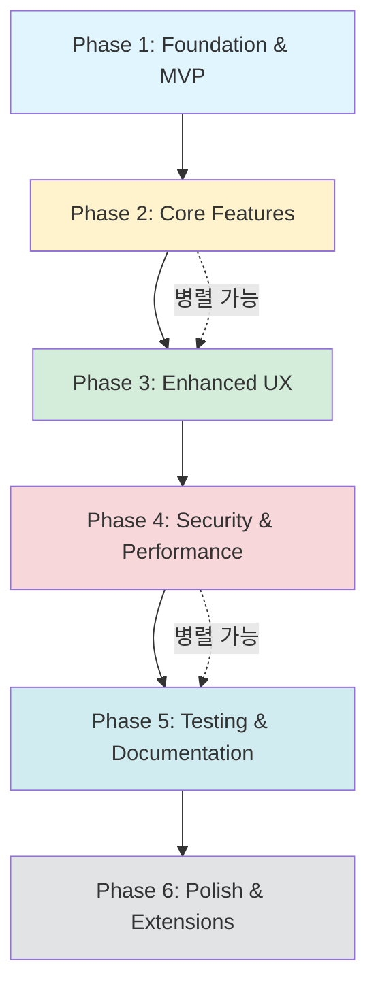

# Editor.js 기반 프로젝트 게시물 에디터 PRD (개선판)

## 1. 문서 개요

**문서명**: 프로젝트 게시물 작성을 위한 Editor.js 기반 커스텀 에디터 도입

**작성일**: 2025년 10월 14일

**버전**: 2.0 (개선판)

**목표**: 기존의 단순 HTML content 필드를 대체하여, 구조화된 JSON(contentJson) 데이터를 생성하는 Editor.js 에디터를 React 환경에 구현합니다. 이를 통해 콘텐츠의 유지보수성과 확장성을 높이고, 사용자에게 풍부한 편집 경험을 제공하며, 보안성과 안정성을 강화하는 것을 목표로 합니다.

## 2. 목표 및 기대효과

**데이터 구조화**: 모든 콘텐츠를 예측 가능한 JSON 형식으로 저장하여 데이터 관리를 용이하게 합니다.

**사용자 경험(UX) 향상**: 직관적인 블록 기반 에디터를 통해 이미지, 영상, 텍스트를 손쉽게 추가하고 편집할 수 있도록 합니다.

**개발 생산성 향상**: 프론트엔드와 백엔드 간의 데이터 교환을 명확한 스키마 기반으로 진행하여 개발 효율을 높입니다.

**렌더링 제어**: 구조화된 데이터를 기반으로 웹, 앱 등 다양한 플랫폼에서 일관된 스타일의 뷰(View)를 렌더링할 수 있습니다.

**보안성 강화**: XSS 공격 방지 및 안전한 콘텐츠 렌더링을 보장합니다.

**데이터 손실 방지**: 임시 저장 및 자동 저장 기능을 통해 사용자의 작업 내용을 보호합니다.

## 3. 사용자 스토리

**관리자(게시물 작성자)**는 프로젝트의 제목, 썸네일, 해시태그 등 메타 정보를 별도의 입력 필드에 쉽게 입력할 수 있다.

관리자는 summary 필드에 지도교수, 참여학생, 진행 날짜 정보를 텍스트 형식으로 입력할 수 있다.

관리자는 Editor.js 에디터 영역에서 키보드 Tab 또는 / 명령어를 통해 텍스트, 이미지, 영상(링크) 등 다양한 콘텐츠 블록을 추가할 수 있다.

관리자는 이미지를 업로드하면 로컬 서버에 저장되고, 해당 이미지의 URL이 에디터에 삽입되는 것을 확인할 수 있다.

관리자는 실수로 작업한 내용을 되돌릴 수 있도록 실행 취소(Undo) 기능을 사용할 수 있다.

관리자는 작성 중인 내용이 자동으로 임시 저장되어 브라우저를 닫아도 작업 내용을 복구할 수 있다.

관리자는 페이지를 이탈하려 할 때 저장하지 않은 변경사항이 있으면 경고 메시지를 받을 수 있다.

관리자는 기존 게시물을 불러와 수정하고 다시 저장할 수 있다.

관리자는 '저장' 버튼을 누르면, 입력한 모든 메타 정보와 Editor.js 콘텐츠가 최종적으로 하나의 JSON 객체로 통합되어 서버로 전송되는 것을 원한다.

관리자는 저장 실패 시 명확한 오류 메시지를 받고, 로컬에 백업된 데이터를 복구할 수 있다.

방문자는 프로젝트 상세 페이지에서 관리자가 작성한 내용이 의도된 디자인과 레이아웃으로 표시되는 것을 볼 수 있다.

방문자는 악의적인 스크립트가 삽입된 콘텐츠로부터 안전하게 보호받을 수 있다.

## 4. 요구사항 및 구현 방안

### 4.1. 타입 정의 (Types Definition)

프로젝트 전체에서 사용할 타입을 먼저 정의합니다.

```typescript
// types/editor.ts
import { OutputData, OutputBlockData } from '@editorjs/editorjs';

export interface EditorBlock extends OutputBlockData {
  id: string;
  type: 'paragraph' | 'header' | 'image' | 'embed' | 'list';
  data: {
    text?: string;
    level?: number;
    file?: {
      url: string;
      width?: number;
      height?: number;
    };
    caption?: string;
    embed?: string;
    width?: number;
    height?: number;
    items?: string[];
    style?: 'ordered' | 'unordered';
  };
}

export interface ProjectFormData {
  title: string;
  subTitle: string;
  thumbnail1: string;
  thumbnail2: string;
  hashTag: string[];
  summary: string;
  isOnMain: boolean;
  isGroup: boolean;
  contentJson: OutputData;
  editorVersion: string;
}

export interface EditorComponentProps {
  initialData?: OutputData;
  mode: 'create' | 'edit';
  projectId?: string;
  onSave?: (data: ProjectFormData) => void;
  onError?: (error: Error) => void;
}
```

### 4.2. 스키마 검증 (Schema Validation)

Zod를 사용하여 런타임 타입 검증을 수행합니다.

```typescript
// schemas/project.schema.ts
import { z } from 'zod';

export const projectFormSchema = z.object({
  title: z.string().min(1, '제목을 입력해주세요').max(200, '제목은 200자를 초과할 수 없습니다'),
  subTitle: z.string().max(300, '부제목은 300자를 초과할 수 없습니다').optional(),
  thumbnail1: z.string().url('올바른 URL 형식이 아닙니다').optional(),
  thumbnail2: z.string().url('올바른 URL 형식이 아닙니다').optional(),
  hashTag: z.array(z.string()).max(10, '해시태그는 최대 10개까지 입력 가능합니다'),
  summary: z.string().min(1, '요약 정보를 입력해주세요'),
  isOnMain: z.boolean(),
  isGroup: z.boolean(),
  contentJson: z.object({
    time: z.number(),
    blocks: z.array(z.any()).min(1, '내용을 입력해주세요'),
    version: z.string(),
  }),
  editorVersion: z.string(),
});

export type ProjectFormData = z.infer<typeof projectFormSchema>;
```

### 4.3. 게시물 작성 페이지 (Editor Component)

게시물 작성을 위한 페이지는 메타데이터 입력 영역과 Editor.js 편집 영역으로 구분합니다.

#### A. 메타데이터 입력 영역 (Form UI with React Hook Form)

Project 모델의 contentJson을 제외한 필드들을 입력받는 React 컴포넌트입니다. React Hook Form을 사용하여 폼 관리를 효율적으로 수행합니다.

```typescript
// components/ProjectMetadataForm.tsx
import { useForm } from 'react-hook-form';
import { zodResolver } from '@hookform/resolvers/zod';
import { projectFormSchema } from '@/schemas/project.schema';

interface ProjectMetadataFormProps {
  defaultValues?: Partial<ProjectFormData>;
  onSubmit: (data: Partial<ProjectFormData>) => void;
}

const ProjectMetadataForm = ({ defaultValues, onSubmit }: ProjectMetadataFormProps) => {
  const {
    register,
    handleSubmit,
    formState: { errors },
    setValue,
    watch,
  } = useForm<Partial<ProjectFormData>>({
    resolver: zodResolver(projectFormSchema.partial()),
    defaultValues,
  });

  return (
    <form onSubmit={handleSubmit(onSubmit)} className="space-y-6">
      {/* 제목 */}
      <div>
        <label htmlFor="title" className="block text-sm font-medium">
          제목 <span className="text-red-500">*</span>
        </label>
        <input
          id="title"
          type="text"
          {...register('title')}
          className="mt-1 block w-full rounded-md border-gray-300 shadow-sm"
          placeholder="프로젝트 제목을 입력하세요"
        />
        {errors.title && <p className="mt-1 text-sm text-red-600">{errors.title.message}</p>}
      </div>

      {/* 부제목 */}
      <div>
        <label htmlFor="subTitle" className="block text-sm font-medium">
          부제목
        </label>
        <input
          id="subTitle"
          type="text"
          {...register('subTitle')}
          className="mt-1 block w-full rounded-md border-gray-300 shadow-sm"
          placeholder="부제목을 입력하세요 (선택사항)"
        />
        {errors.subTitle && <p className="mt-1 text-sm text-red-600">{errors.subTitle.message}</p>}
      </div>

      {/* 썸네일 이미지 업로드 */}
      <div className="grid grid-cols-2 gap-4">
        <ImageUploadField
          label="썸네일 1"
          name="thumbnail1"
          register={register}
          setValue={setValue}
          currentValue={watch('thumbnail1')}
          error={errors.thumbnail1}
        />
        <ImageUploadField
          label="썸네일 2"
          name="thumbnail2"
          register={register}
          setValue={setValue}
          currentValue={watch('thumbnail2')}
          error={errors.thumbnail2}
        />
      </div>

      {/* 해시태그 */}
      <div>
        <label htmlFor="hashTag" className="block text-sm font-medium">
          해시태그 <span className="text-red-500">*</span>
        </label>
        <TagInput
          value={watch('hashTag') || []}
          onChange={(tags) => setValue('hashTag', tags)}
          placeholder="Enter를 눌러 태그 추가"
        />
        {errors.hashTag && <p className="mt-1 text-sm text-red-600">{errors.hashTag.message}</p>}
      </div>

      {/* 요약 정보 */}
      <div>
        <label htmlFor="summary" className="block text-sm font-medium">
          요약 정보 <span className="text-red-500">*</span>
        </label>
        <textarea
          id="summary"
          {...register('summary')}
          rows={4}
          className="mt-1 block w-full rounded-md border-gray-300 shadow-sm"
          placeholder="지도교수, 참여학생, 진행 날짜 등을 입력하세요"
        />
        {errors.summary && <p className="mt-1 text-sm text-red-600">{errors.summary.message}</p>}
      </div>

      {/* 체크박스 */}
      <div className="flex gap-6">
        <label className="flex items-center">
          <input type="checkbox" {...register('isOnMain')} className="rounded border-gray-300" />
          <span className="ml-2 text-sm">메인 페이지 노출</span>
        </label>
        <label className="flex items-center">
          <input type="checkbox" {...register('isGroup')} className="rounded border-gray-300" />
          <span className="ml-2 text-sm">그룹 프로젝트</span>
        </label>
      </div>
    </form>
  );
};
```

#### B. Editor.js 편집 영역 (Editor Core)

contentJson 데이터를 생성하는 핵심 영역입니다.

```typescript
// components/EditorComponent.tsx
import { useEffect, useRef, useState } from 'react';
import EditorJS, { OutputData } from '@editorjs/editorjs';
import Header from '@editorjs/header';
import ImageTool from '@editorjs/image';
import Embed from '@editorjs/embed';
import List from '@editorjs/list';
import Undo from 'editorjs-undo';

interface EditorComponentProps {
  initialData?: OutputData;
  onChange?: (data: OutputData) => void;
  readOnly?: boolean;
}

const EditorComponent = ({ initialData, onChange, readOnly = false }: EditorComponentProps) => {
  const editorRef = useRef<EditorJS | null>(null);
  const [isReady, setIsReady] = useState(false);

  useEffect(() => {
    // 이미 초기화되어 있으면 리턴
    if (editorRef.current) return;

    const initEditor = async () => {
      const editor = new EditorJS({
        holder: 'editorjs-container',
        readOnly,
        placeholder: '내용을 입력하세요. Tab 또는 /를 눌러 블록을 추가할 수 있습니다.',
        data: initialData,

        tools: {
          header: {
            class: Header,
            config: {
              placeholder: '제목을 입력하세요',
              levels: [1, 2, 3, 4],
              defaultLevel: 2,
            },
          },

          list: {
            class: List,
            inlineToolbar: true,
            config: {
              defaultStyle: 'unordered',
            },
          },

          image: {
            class: ImageTool,
            config: {
              uploader: {
                /**
                 * 파일을 업로드하는 메서드
                 */
                async uploadByFile(file: File) {
                  try {
                    // 1. 파일 크기 검증 (5MB)
                    const maxSize = 5 * 1024 * 1024;
                    if (file.size > maxSize) {
                      throw new Error('파일 크기는 5MB를 초과할 수 없습니다');
                    }

                    // 2. 파일 형식 검증
                    const allowedTypes = ['image/jpeg', 'image/png', 'image/webp', 'image/gif'];
                    if (!allowedTypes.includes(file.type)) {
                      throw new Error(
                        '지원되지 않는 파일 형식입니다. (JPG, PNG, WebP, GIF만 가능)'
                      );
                    }

                    // 3. FormData 생성 및 파일 추가
                    const formData = new FormData();
                    formData.append('image', file);

                    // 4. 로컬 서버로 파일 업로드 요청
                    const response = await fetch('/api/upload-image', {
                      method: 'POST',
                      body: formData,
                    });

                    if (!response.ok) {
                      const errorData = await response.json();
                      throw new Error(errorData.message || '이미지 업로드에 실패했습니다');
                    }

                    const result = await response.json();

                    // 5. Editor.js가 요구하는 형식으로 반환
                    return {
                      success: 1,
                      file: {
                        url: result.imageUrl,
                        width: result.width,
                        height: result.height,
                      },
                    };
                  } catch (error) {
                    console.error('Image upload error:', error);

                    // 사용자에게 에러 알림
                    alert(
                      error instanceof Error
                        ? error.message
                        : '이미지 업로드 중 오류가 발생했습니다'
                    );

                    return {
                      success: 0,
                      message: error instanceof Error ? error.message : 'Upload failed',
                    };
                  }
                },

                /**
                 * URL로 이미지를 추가하는 메서드
                 */
                async uploadByUrl(url: string) {
                  try {
                    // URL 유효성 검증
                    new URL(url);

                    return {
                      success: 1,
                      file: {
                        url,
                      },
                    };
                  } catch (error) {
                    return {
                      success: 0,
                      message: '올바른 URL 형식이 아닙니다',
                    };
                  }
                },
              },
            },
          },

          embed: {
            class: Embed,
            config: {
              services: {
                youtube: true,
                vimeo: true,
                coub: true,
              },
            },
          },
        },

        /**
         * 에디터 준비 완료 콜백
         */
        onReady: () => {
          console.log('Editor.js is ready to work!');
          setIsReady(true);

          // Undo 플러그인 초기화
          if (editorRef.current) {
            new Undo({ editor: editorRef.current });
          }
        },

        /**
         * 내용 변경 콜백 - 자동 저장에 활용
         */
        onChange: async (api, event) => {
          if (onChange && !readOnly) {
            try {
              const data = await api.saver.save();
              onChange(data);

              // 로컬 스토리지에 임시 저장 (3초 디바운스)
              saveToLocalStorage(data);
            } catch (error) {
              console.error('Error saving editor data:', error);
            }
          }
        },
      });

      editorRef.current = editor;
    };

    initEditor();

    // 클린업 함수
    return () => {
      if (editorRef.current && editorRef.current.destroy) {
        editorRef.current.destroy();
        editorRef.current = null;
      }
    };
  }, [initialData, readOnly]);

  /**
   * 로컬 스토리지에 임시 저장
   */
  const saveToLocalStorage = useDebounce((data: OutputData) => {
    try {
      localStorage.setItem(
        'editor-draft',
        JSON.stringify({
          data,
          savedAt: new Date().toISOString(),
        })
      );
    } catch (error) {
      console.error('Failed to save to localStorage:', error);
    }
  }, 3000);

  /**
   * 에디터 데이터 저장 메서드
   */
  const save = async (): Promise<OutputData | null> => {
    if (!editorRef.current) {
      throw new Error('Editor is not initialized');
    }

    try {
      const savedData = await editorRef.current.save();
      return savedData;
    } catch (error) {
      console.error('Saving failed:', error);
      throw error;
    }
  };

  // save 메서드를 외부에서 호출할 수 있도록 노출
  useImperativeHandle(ref, () => ({
    save,
  }));

  return (
    <div className="editor-wrapper">
      <div
        id="editorjs-container"
        className="prose max-w-none min-h-[400px] p-4 border rounded-lg"
      />
      {isReady && (
        <div className="mt-2 text-sm text-gray-500">
          💡 Tip: Ctrl+Z로 실행 취소, Tab 또는 /로 블록 추가
        </div>
      )}
    </div>
  );
};

export default EditorComponent;
```

#### C. 임시 저장 및 복구 기능

```typescript
// hooks/useAutoSave.ts
import { useEffect, useState } from 'react';
import { OutputData } from '@editorjs/editorjs';

interface DraftData {
  data: OutputData;
  savedAt: string;
}

export const useAutoSave = () => {
  const [hasDraft, setHasDraft] = useState(false);

  useEffect(() => {
    checkForDraft();
  }, []);

  const checkForDraft = () => {
    const draft = localStorage.getItem('editor-draft');
    setHasDraft(!!draft);
  };

  const loadDraft = (): DraftData | null => {
    try {
      const draft = localStorage.getItem('editor-draft');
      if (!draft) return null;

      return JSON.parse(draft);
    } catch (error) {
      console.error('Failed to load draft:', error);
      return null;
    }
  };

  const clearDraft = () => {
    localStorage.removeItem('editor-draft');
    setHasDraft(false);
  };

  return { hasDraft, loadDraft, clearDraft };
};
```

#### D. 데이터 저장 로직 (Save Logic)

```typescript
// components/ProjectEditor.tsx
import { useState } from 'react';
import { useForm } from 'react-hook-form';
import { zodResolver } from '@hookform/resolvers/zod';
import { projectFormSchema } from '@/schemas/project.schema';
import { useAutoSave } from '@/hooks/useAutoSave';
import { useBeforeUnload } from '@/hooks/useBeforeUnload';

interface ProjectEditorProps {
  mode: 'create' | 'edit';
  initialData?: ProjectFormData;
  projectId?: string;
}

const ProjectEditor = ({ mode, initialData, projectId }: ProjectEditorProps) => {
  const editorRef = useRef<{ save: () => Promise<OutputData> }>(null);
  const [isSaving, setIsSaving] = useState(false);
  const [hasUnsavedChanges, setHasUnsavedChanges] = useState(false);
  const { hasDraft, loadDraft, clearDraft } = useAutoSave();

  // 페이지 이탈 경고
  useBeforeUnload(hasUnsavedChanges);

  // 임시 저장된 데이터 복구 확인
  useEffect(() => {
    if (hasDraft && mode === 'create') {
      const shouldRestore = confirm('저장되지 않은 작업 내용이 있습니다. 복구하시겠습니까?');

      if (shouldRestore) {
        const draft = loadDraft();
        if (draft) {
          // 에디터에 draft 데이터 로드
          // initialData로 전달하거나 에디터 API 사용
        }
      } else {
        clearDraft();
      }
    }
  }, []);

  /**
   * 저장 버튼 클릭 핸들러
   */
  const handleSave = async (metaData: Partial<ProjectFormData>) => {
    if (!editorRef.current) {
      alert('에디터가 준비되지 않았습니다');
      return;
    }

    setIsSaving(true);

    try {
      // 1. Editor.js 데이터 가져오기
      const editorData = await editorRef.current.save();

      // 2. 데이터 유효성 검증
      const finalPostData: ProjectFormData = {
        ...metaData,
        contentJson: editorData,
        editorVersion: editorData.version || '2.28.0',
      } as ProjectFormData;

      // Zod 스키마로 검증
      const validatedData = projectFormSchema.parse(finalPostData);

      // 3. API 호출
      const endpoint = mode === 'edit' ? `/api/projects/${projectId}` : '/api/projects';

      const method = mode === 'edit' ? 'PUT' : 'POST';

      const response = await fetch(endpoint, {
        method,
        headers: {
          'Content-Type': 'application/json',
        },
        body: JSON.stringify(validatedData),
      });

      if (!response.ok) {
        const errorData = await response.json();
        throw new Error(errorData.message || '저장에 실패했습니다');
      }

      const result = await response.json();

      // 4. 성공 처리
      alert('저장되었습니다!');
      clearDraft(); // 임시 저장 데이터 삭제
      setHasUnsavedChanges(false);

      // 목록 페이지로 이동
      window.location.href = '/projects';
    } catch (error) {
      console.error('Save error:', error);

      if (error instanceof z.ZodError) {
        // 유효성 검증 오류
        const errorMessages = error.errors.map((err) => err.message).join('\n');
        alert(`입력 내용을 확인해주세요:\n${errorMessages}`);
      } else {
        // 기타 오류
        alert(error instanceof Error ? error.message : '저장 중 오류가 발생했습니다');

        // 로컬 스토리지에 백업
        try {
          const backupData = await editorRef.current.save();
          localStorage.setItem(
            'editor-backup',
            JSON.stringify({
              ...metaData,
              contentJson: backupData,
              backedUpAt: new Date().toISOString(),
            })
          );
          alert('작업 내용이 로컬에 백업되었습니다');
        } catch (backupError) {
          console.error('Backup failed:', backupError);
        }
      }
    } finally {
      setIsSaving(false);
    }
  };

  return (
    <div className="max-w-4xl mx-auto p-6">
      <h1 className="text-3xl font-bold mb-6">
        {mode === 'create' ? '프로젝트 생성' : '프로젝트 수정'}
      </h1>

      {/* 메타데이터 폼 */}
      <ProjectMetadataForm defaultValues={initialData} onSubmit={handleSave} />

      {/* 에디터 */}
      <div className="mt-8">
        <h2 className="text-xl font-semibold mb-4">프로젝트 내용</h2>
        <EditorComponent
          ref={editorRef}
          initialData={initialData?.contentJson}
          onChange={() => setHasUnsavedChanges(true)}
        />
      </div>

      {/* 저장 버튼 */}
      <div className="mt-8 flex gap-4">
        <button
          type="button"
          onClick={() => {
            // 폼 제출 트리거
            document.getElementById('metadata-form')?.requestSubmit();
          }}
          disabled={isSaving}
          className="px-6 py-2 bg-blue-600 text-white rounded-lg disabled:opacity-50"
        >
          {isSaving ? '저장 중...' : '저장'}
        </button>

        <button
          type="button"
          onClick={() => window.history.back()}
          className="px-6 py-2 bg-gray-300 text-gray-700 rounded-lg"
        >
          취소
        </button>
      </div>
    </div>
  );
};
```

### 4.4. 게시물 조회 페이지 (Viewer Component)

서버에서 가져온 contentJson 데이터를 사용자에게 보여주는 페이지입니다.

#### A. editorjs-react-renderer 사용 방식 (추천)

```typescript
// components/ProjectViewer.tsx
import Output from 'editorjs-react-renderer';
import DOMPurify from 'isomorphic-dompurify';
import { OutputData } from '@editorjs/editorjs';

interface ProjectViewerProps {
  project: {
    title: string;
    subTitle?: string;
    summary: string;
    hashTag: string[];
    contentJson: OutputData;
    thumbnail1?: string;
    thumbnail2?: string;
  };
}

const ProjectViewer = ({ project }: ProjectViewerProps) => {
  if (!project.contentJson?.blocks) {
    return (
      <div className="text-center py-12">
        <p className="text-gray-500">콘텐츠를 불러올 수 없습니다.</p>
      </div>
    );
  }

  // 커스텀 렌더러 설정
  const customRenderers = {
    paragraph: ({ data }: any) => (
      <p
        className="mb-4 text-gray-800 leading-relaxed"
        dangerouslySetInnerHTML={{ __html: DOMPurify.sanitize(data.text) }}
      />
    ),

    header: ({ data }: any) => {
      const level = Math.min(Math.max(data.level || 1, 1), 6);
      const Tag = `h${level}` as keyof JSX.IntrinsicElements;
      const classes = {
        1: 'text-4xl font-bold mb-6',
        2: 'text-3xl font-bold mb-5',
        3: 'text-2xl font-bold mb-4',
        4: 'text-xl font-semibold mb-3',
        5: 'text-lg font-semibold mb-2',
        6: 'text-base font-semibold mb-2',
      };

      return (
        <Tag
          className={classes[level as keyof typeof classes]}
          dangerouslySetInnerHTML={{ __html: DOMPurify.sanitize(data.text) }}
        />
      );
    },

    image: ({ data }: any) => {
      if (!data.file?.url) return null;

      return (
        <figure className="my-6">
          
          {data.caption && (
            <figcaption className="text-sm text-gray-600 text-center mt-2">
              {data.caption}
            </figcaption>
          )}
        </figure>
      );
    },

    list: ({ data }: any) => {
      const ListTag = data.style === 'ordered' ? 'ol' : 'ul';
      const listClass =
        data.style === 'ordered' ? 'list-decimal list-inside' : 'list-disc list-inside';

      return (
        <ListTag className={`mb-4 ${listClass}`}>
          {data.items.map((item: string, index: number) => (
            <li
              key={index}
              className="mb-2"
              dangerouslySetInnerHTML={{ __html: DOMPurify.sanitize(item) }}
            />
          ))}
        </ListTag>
      );
    },

    embed: ({ data }: any) => {
      if (!data.embed) return null;

      return (
        <div className="my-6 aspect-video">
          <iframe
            src={data.embed}
            width="100%"
            height="100%"
            allowFullScreen
            className="rounded-lg"
          />
        </div>
      );
    },
  };

  return (
    <article className="max-w-4xl mx-auto p-6">
      {/* 헤더 영역 */}
      <header className="mb-8">
        <h1 className="text-4xl font-bold mb-2">{project.title}</h1>
        {project.subTitle && <h2 className="text-xl text-gray-600 mb-4">{project.subTitle}</h2>}

        {/* 해시태그 */}
        {project.hashTag && project.hashTag.length > 0 && (
          <div className="flex flex-wrap gap-2 mb-4">
            {project.hashTag.map((tag, index) => (
              <span
                key={index}
                className="px-3 py-1 bg-blue-100 text-blue-700 rounded-full text-sm"
              >
                #{tag}
              </span>
            ))}
          </div>
        )}

        {/* 요약 정보 */}
        <div className="p-4 bg-gray-50 rounded-lg whitespace-pre-line">{project.summary}</div>
      </header>

      {/* 본문 콘텐츠 */}
      <div className="prose prose-lg max-w-none">
        <Output data={project.contentJson} renderers={customRenderers} />
      </div>
    </article>
  );
};

export default ProjectViewer;
```

#### B. 수동 렌더링 방식 (대안)

```typescript
// components/ProjectViewerManual.tsx
import DOMPurify from 'isomorphic-dompurify';
import { EditorBlock } from '@/types/editor';

const ProjectViewerManual = ({ contentJson }: { contentJson: OutputData }) => {
  if (!contentJson?.blocks) {
    return <div>콘텐츠를 불러올 수 없습니다.</div>;
  }

  const renderBlock = (block: EditorBlock) => {
    try {
      switch (block.type) {
        case 'header': {
          const level = Math.min(Math.max(block.data.level || 1, 1), 6);
          const Tag = `h${level}` as keyof JSX.IntrinsicElements;
          return (
            <Tag
              key={block.id}
              dangerouslySetInnerHTML={{
                __html: DOMPurify.sanitize(block.data.text || ''),
              }}
            />
          );
        }

        case 'paragraph':
          return (
            <p
              key={block.id}
              dangerouslySetInnerHTML={{
                __html: DOMPurify.sanitize(block.data.text || ''),
              }}
            />
          );

        case 'image': {
          if (!block.data.file?.url) return null;
          return (
            <figure key={block.id} className="my-4">
              
              {block.data.caption && (
                <figcaption className="text-sm text-gray-600 mt-2">{block.data.caption}</figcaption>
              )}
            </figure>
          );
        }

        case 'embed':
          if (!block.data.embed) return null;
          return (
            <iframe
              key={block.id}
              src={block.data.embed}
              width={block.data.width || '100%'}
              height={block.data.height || 400}
              allowFullScreen
              className="my-4 rounded-lg"
            />
          );

        case 'list': {
          const ListTag = block.data.style === 'ordered' ? 'ol' : 'ul';
          return (
            <ListTag key={block.id} className="my-4">
              {block.data.items?.map((item: string, index: number) => (
                <li
                  key={index}
                  dangerouslySetInnerHTML={{
                    __html: DOMPurify.sanitize(item),
                  }}
                />
              ))}
            </ListTag>
          );
        }

        default:
          console.warn('Unsupported block type:', block.type);
          return null;
      }
    } catch (error) {
      console.error('Error rendering block:', error);
      return null;
    }
  };

  return <article className="prose max-w-none">{contentJson.blocks.map(renderBlock)}</article>;
};
```

## 5. 기술 스택 및 라이브러리

### 5.1 코어 라이브러리

- **프레임워크**: React 18
- **언어**: TypeScript 5.x
- **코어 에디터**: @editorjs/editorjs ^2.28.0

### 5.2 Editor.js 도구 (Tools)

- **@editorjs/header**: 제목 블록
- **@editorjs/paragraph**: 단락 블록 (기본값)
- **@editorjs/image**: 이미지 업로드
- **@editorjs/embed**: 영상 임베드
- **@editorjs/list**: 목록
- **editorjs-undo**: 실행 취소/다시 실행

### 5.3 폼 관리 및 검증

- **react-hook-form**: 폼 상태 관리
- **@hookform/resolvers**: React Hook Form과 Zod 통합
- **zod**: 스키마 기반 유효성 검증

### 5.4 보안

- **isomorphic-dompurify**: XSS 방지를 위한 HTML 새니타이징

### 5.5 렌더링

- **editorjs-react-renderer**: Editor.js 데이터를 React 컴포넌트로 렌더링

### 5.6 UI 컴포넌트 (선택사항)

- **react-tag-input** 또는 **react-tagsinput**: 해시태그 입력
- **Tailwind CSS**: 스타일링
- **shadcn/ui**: UI 컴포넌트 라이브러리

### 5.7 개발 도구

- **Storybook**: 컴포넌트 개발 및 문서화
- **ESLint**: 코드 품질 관리
- **Prettier**: 코드 포맷팅

## 6. 비기능적 요구사항

### 6.1 성능

- **에디터 초기 로딩 시간**: 2초 이내
- **이미지 업로드 시간**: 5MB 이하 파일 기준 10초 이내
- **게시물 렌더링 시간**: 1초 이내
- **자동 저장 간격**: 3초 디바운스

### 6.2 보안

- **XSS 방지**: DOMPurify를 통한 모든 사용자 입력 새니타이징
- **파일 업로드 검증**:
  - 허용 확장자: JPG, PNG, WebP, GIF
  - MIME 타입 검증
  - 최대 파일 크기: 5MB
- **권한 검증**: 관리자만 작성/수정 가능 (서버 사이드 검증 필수)

### 6.3 접근성 (WCAG 2.1 AA 준수)

- 키보드 네비게이션 지원
- 스크린 리더 호환성 (ARIA 레이블)
- 충분한 색상 대비 (4.5:1 이상)
- 포커스 인디케이터 제공

### 6.4 브라우저 호환성

- Chrome 최신 2개 버전
- Firefox 최신 2개 버전
- Safari 최신 2개 버전
- Edge 최신 2개 버전

### 6.5 반응형 디자인

- 데스크톱: 1024px 이상
- 태블릿: 768px - 1023px
- 모바일: 767px 이하

## 7. 에러 처리 및 예외 상황

### 7.1 이미지 업로드 관련

**문제 상황**:

- 네트워크 오류
- 파일 크기 초과
- 지원되지 않는 파일 형식
- 서버 저장 공간 부족

**처리 방안**:

- 명확한 에러 메시지 표시
- 재시도 버튼 제공
- 업로드 진행률 표시
- 실패 시 로컬에 임시 저장

### 7.2 저장 실패

**문제 상황**:

- API 서버 오류
- 네트워크 연결 끊김
- 유효성 검증 실패
- 세션 만료

**처리 방안**:

- 로컬 스토리지에 자동 백업
- 재시도 기능 제공
- 실패 원인별 구체적인 안내 메시지
- 백업 데이터 복구 옵션 제공

### 7.3 데이터 손실 방지

**구현 사항**:

- 3초마다 자동 임시 저장
- 페이지 이탈 시 경고 메시지 (beforeunload 이벤트)
- 브라우저 종료 후 재접속 시 복구 옵션 제공
- 수동 '임시 저장' 버튼 제공

### 7.4 렌더링 오류

**문제 상황**:

- 손상된 contentJson 데이터
- 지원되지 않는 블록 타입
- 누락된 필수 속성

**처리 방안**:

- try-catch로 각 블록별 오류 격리
- 오류 발생 블록은 건너뛰고 계속 렌더링
- 개발자 콘솔에 경고 로그 출력
- 사용자에게는 "일부 콘텐츠를 표시할 수 없습니다" 메시지

```typescript
// hooks/useBeforeUnload.ts
import { useEffect } from 'react';

export const useBeforeUnload = (hasUnsavedChanges: boolean) => {
  useEffect(() => {
    const handleBeforeUnload = (e: BeforeUnloadEvent) => {
      if (hasUnsavedChanges) {
        e.preventDefault();
        e.returnValue = '';
        return '';
      }
    };

    window.addEventListener('beforeunload', handleBeforeUnload);

    return () => {
      window.removeEventListener('beforeunload', handleBeforeUnload);
    };
  }, [hasUnsavedChanges]);
};
```

## 8. 구현 계획 (Implementation Phases)

### 개요

본 프로젝트는 점진적 개발(Incremental Development) 방식을 채택하여 6개의 Phase로 구성됩니다. 각 Phase는 명확한 목표와 완료 기준(Definition of Done)을 가지며, 독립적으로 배포 가능한 기능 단위로 설계되었습니다.

**전체 예상 기간**: 7.5주 (MVP 완성: 4주, 프로덕션 준비: 6.5주)

---

### Phase 1: Foundation & MVP (2주)

**목표**: 기본적인 텍스트 작성 및 저장이 가능한 최소 기능 에디터 구현

#### 핵심 가치

- 프로젝트 기반 구조 확립
- Editor.js 통합 검증
- 기본 CRUD 동작 확인

#### 세부 작업

**Week 1: 환경 설정 및 기본 인프라 (3일)**

- [ ] React + TypeScript 프로젝트 초기화
- [ ] 필수 패키지 설치

  ```bash
  # 코어 에디터
  npm install @editorjs/editorjs @editorjs/header @editorjs/paragraph

  # 폼 관리 및 검증
  npm install react-hook-form @hookform/resolvers zod

  # 유틸리티
  npm install lodash.debounce
  ```

- [ ] 프로젝트 폴더 구조 설정
  ```
  src/
  ├── components/
  │   ├── editor/
  │   └── forms/
  ├── types/
  ├── schemas/
  ├── hooks/
  ├── utils/
  └── pages/
  ```
- [ ] ESLint, Prettier 설정
- [ ] 타입 정의 파일 작성 (`types/editor.ts`)
- [ ] 스키마 정의 (`schemas/project.schema.ts`)

**Week 1-2: 기본 에디터 구현 (4일)**

- [ ] Editor.js 컴포넌트 뼈대 작성 (`EditorComponent.tsx`)
  - Editor.js 인스턴스 생성 및 초기화
  - Paragraph, Header 블록만 포함 (최소 구성)
  - onChange 핸들러 구현
- [ ] 간단한 메타데이터 폼 (`SimpleMetadataForm.tsx`)
  - 제목(title) 입력 필드만 포함
  - React Hook Form 통합
  - Zod 스키마 검증
- [ ] 저장 로직 기본 구현
  - 메타데이터 + contentJson 통합
  - 콘솔 로그로 데이터 구조 확인
  - Mock API 응답 처리

**Week 2: 데이터 조회 및 렌더링 (3일)**

- [ ] 간단한 Viewer 컴포넌트 작성
  - Paragraph, Header 블록 수동 렌더링
  - DOMPurify는 이후 Phase에서 추가 (일단 기본 렌더링만)
- [ ] 라우팅 설정
  - `/projects/new` - 작성 페이지
  - `/projects/:id` - 조회 페이지
- [ ] Mock 데이터로 전체 플로우 테스트

#### 완료 기준 (Definition of Done)

- [x] Editor.js가 정상적으로 초기화되고 텍스트 입력이 가능함
- [x] 제목과 본문 내용을 저장하고 조회할 수 있음
- [x] TypeScript 컴파일 에러가 없음
- [x] 기본 라우팅이 동작함
- [x] 코드 리뷰 완료

#### 리스크 및 대응

| 리스크                    | 영향도 | 대응 방안                                          |
| ------------------------- | ------ | -------------------------------------------------- |
| Editor.js React 통합 이슈 | 높음   | useEffect 의존성 배열 주의, 공식 문서 참고         |
| TypeScript 타입 불일치    | 중간   | @editorjs/editorjs 타입 정의 확인, any 사용 최소화 |

---

### Phase 2: Core Features (2주)

**목표**: 이미지, 영상, 리스트 등 모든 블록 타입과 전체 메타데이터 입력 기능 구현

#### 핵심 가치

- 완전한 게시물 작성 기능 제공
- 미디어 콘텐츠 지원
- 프로덕션 수준의 데이터 구조

#### 세부 작업

**Week 3: 이미지 업로드 구현 (5일)**

- [ ] 이미지 업로드 API 엔드포인트 구현 (`/api/upload-image`)
  ```typescript
  // pages/api/upload-image.ts
  // - formidable 패키지 사용
  // - 파일 크기 검증 (최대 5MB)
  // - MIME 타입 검증 (image/jpeg, image/png, image/webp, image/gif)
  // - 파일명 UUID 생성으로 충돌 방지
  // - public/uploads 디렉토리에 저장
  ```
- [ ] 필수 패키지 설치
  ```bash
  npm install @editorjs/image formidable uuid
  npm install --save-dev @types/formidable @types/uuid
  ```
- [ ] Editor.js Image Tool 통합
  - uploadByFile 메서드 구현
  - uploadByUrl 메서드 구현
  - 에러 처리 (파일 크기, 형식, 업로드 실패)
  - 업로드 진행률 표시 (선택사항)
- [ ] 썸네일 업로드 컴포넌트 (`ImageUploadField.tsx`)
  - Drag & Drop 지원
  - 미리보기 기능
  - 삭제 기능

**Week 3-4: 추가 블록 타입 및 메타데이터 폼 (5일)**

- [ ] 추가 Editor.js 도구 설치
  ```bash
  npm install @editorjs/list @editorjs/embed
  ```
- [ ] Editor.js 설정에 List, Embed 추가
  - List: ordered/unordered 옵션
  - Embed: YouTube, Vimeo 지원
- [ ] 전체 메타데이터 폼 구현 (`ProjectMetadataForm.tsx`)
  - [ ] 제목 (title) - 필수, 최대 200자
  - [ ] 부제목 (subTitle) - 선택, 최대 300자
  - [ ] 썸네일 1, 2 (thumbnail1, thumbnail2)
  - [ ] 해시태그 (hashTag) - 배열, 최대 10개
  - [ ] 요약 정보 (summary) - 필수, textarea
  - [ ] 체크박스 (isOnMain, isGroup)
- [ ] 해시태그 입력 컴포넌트 (`TagInput.tsx`)
  ```bash
  npm install react-tag-input
  ```
  - Enter 키로 태그 추가
  - 삭제 기능
  - 최대 10개 제한

#### 완료 기준 (Definition of Done)

- [x] 이미지를 업로드하고 에디터에 삽입할 수 있음
- [x] YouTube 영상을 임베드할 수 있음
- [x] 리스트(번호, 불릿)를 작성할 수 있음
- [x] 모든 메타데이터 필드가 정상적으로 동작함
- [x] 업로드된 이미지가 서버에 저장되고 URL로 접근 가능함
- [x] 스키마 검증이 정상적으로 동작함
- [x] 단위 테스트 작성 (이미지 업로드 API, 스키마 검증)

#### 리스크 및 대응

| 리스크               | 영향도 | 대응 방안                             |
| -------------------- | ------ | ------------------------------------- |
| 파일 업로드 실패     | 높음   | 재시도 메커니즘, 명확한 에러 메시지   |
| 대용량 이미지 업로드 | 중간   | 클라이언트 측 압축(선택), 진행률 표시 |
| CORS 이슈            | 낮음   | Next.js API Route 사용으로 회피       |

---

### Phase 3: Enhanced UX (1.5주)

**목표**: 데이터 손실 방지 및 사용자 편의 기능 구현

#### 핵심 가치

- 안정적인 사용자 경험
- 데이터 손실 최소화
- 작업 흐름 개선

#### 세부 작업

**Week 5: 자동 저장 및 복구 (4일)**

- [ ] Undo/Redo 플러그인 통합
  ```bash
  npm install editorjs-undo
  ```
  - Editor.js onReady 콜백에서 초기화
  - Ctrl+Z, Ctrl+Shift+Z 단축키 안내
- [ ] 자동 임시 저장 구현 (`hooks/useAutoSave.ts`)
  - onChange 이벤트에 디바운스 적용 (3초)
  - localStorage에 저장
  - 저장 시간 표시
- [ ] 임시 저장 데이터 복구
  - 페이지 로드 시 localStorage 확인
  - 복구 여부 confirm 다이얼로그
  - 복구 후 localStorage 데이터 삭제
- [ ] 페이지 이탈 경고 (`hooks/useBeforeUnload.ts`)
  - 저장하지 않은 변경사항 감지
  - beforeunload 이벤트 처리

**Week 5-6: 로딩 상태 및 에러 처리 (3일)**

- [ ] 전역 로딩 상태 관리
  - 저장 중 버튼 비활성화
  - 로딩 스피너 표시
- [ ] 에러 처리 개선
  - 저장 실패 시 로컬 백업
  - 명확한 에러 메시지
  - Zod 검증 오류 사용자 친화적 표시
- [ ] Toast 알림 시스템 (선택사항)
  ```bash
  npm install react-hot-toast
  ```
  - 성공/실패 알림
  - 자동 임시 저장 알림

#### 완료 기준 (Definition of Done)

- [x] Ctrl+Z로 작업을 되돌릴 수 있음
- [x] 3초마다 자동으로 임시 저장됨
- [x] 브라우저 종료 후 재접속 시 임시 저장 데이터 복구 가능
- [x] 페이지 이탈 시 경고 메시지 표시
- [x] 저장 실패 시 로컬에 백업됨
- [x] 통합 테스트 작성 (자동 저장, 복구 플로우)

#### 리스크 및 대응

| 리스크                 | 영향도 | 대응 방안                                          |
| ---------------------- | ------ | -------------------------------------------------- |
| localStorage 용량 초과 | 낮음   | 이미지는 URL만 저장, 주기적으로 오래된 데이터 삭제 |
| 디바운스 타이밍 이슈   | 낮음   | lodash.debounce 검증된 라이브러리 사용             |

---

### Phase 4: Security & Performance (1주)

**목표**: 보안 강화 및 성능 최적화, 프로덕션 준비 완료

#### 핵심 가치

- XSS 공격 방지
- 안전한 파일 업로드
- 빠른 로딩 속도
- 접근성 준수

#### 세부 작업

**Week 6-7: 보안 강화 (3일)**

- [ ] XSS 방지 구현
  ```bash
  npm install isomorphic-dompurify
  ```
  - Viewer 컴포넌트에서 모든 HTML 콘텐츠 새니타이징
  - dangerouslySetInnerHTML 사용 최소화
- [ ] 파일 업로드 보안 강화
  - MIME 타입 더블 체크 (Content-Type + Magic Number)
  - 파일명 검증 (경로 탐색 공격 방지)
  - 업로드 디렉토리 외부 접근 차단
- [ ] API 엔드포인트 보안
  - 인증/인가 확인 (관리자만 작성/수정 가능)
  - Rate Limiting (선택사항)
  - CSRF 토큰 (프레임워크 기본 기능 활용)

**Week 7: 성능 최적화 및 접근성 (4일)**

- [ ] 성능 최적화
  - 이미지 lazy loading 적용
  - Editor.js 컴포넌트 동적 import (Code Splitting)
  - 번들 크기 분석 (webpack-bundle-analyzer)
  - 불필요한 리렌더링 방지 (React.memo, useMemo)
- [ ] 접근성 개선 (WCAG 2.1 AA)
  - 키보드 네비게이션 테스트
  - ARIA 레이블 추가
  - 색상 대비 검증 (4.5:1 이상)
  - 포커스 인디케이터 스타일링
  - 스크린 리더 테스트

#### 완료 기준 (Definition of Done)

- [x] DOMPurify로 모든 사용자 입력 새니타이징됨
- [x] XSS 공격 시뮬레이션 테스트 통과
- [x] 파일 업로드 보안 체크리스트 완료
- [x] Lighthouse 성능 점수 90+ (모바일, 데스크톱)
- [x] 에디터 초기 로딩 시간 < 2초
- [x] WAVE 접근성 검사 통과 (0 errors)
- [x] 보안 테스트 (침투 테스트 또는 자동화 도구)

#### 리스크 및 대응

| 리스크                  | 영향도 | 대응 방안                                         |
| ----------------------- | ------ | ------------------------------------------------- |
| DOMPurify 과도한 필터링 | 중간   | 허용 태그 화이트리스트 세밀하게 조정              |
| 성능 저하               | 중간   | 프로파일링으로 병목 지점 식별, 필요시 가상화 적용 |

---

### Phase 5: Testing & Documentation (1주)

**목표**: 안정성 확보 및 유지보수성 향상

#### 핵심 가치

- 버그 최소화
- 코드 품질 향상
- 팀 협업 효율성

#### 세부 작업

**Week 7-8: 테스트 작성 (4일)**

- [ ] 테스트 환경 설정
  ```bash
  npm install --save-dev @testing-library/react @testing-library/jest-dom \
    @testing-library/user-event jest-environment-jsdom
  ```
- [ ] 단위 테스트
  - [ ] 스키마 검증 로직 (`project.schema.test.ts`)
  - [ ] 이미지 업로드 API (`upload-image.test.ts`)
  - [ ] 유틸리티 함수 (디바운스, 새니타이징)
- [ ] 통합 테스트
  - [ ] 전체 작성 플로우 (메타데이터 입력 → 에디터 작성 → 저장)
  - [ ] 임시 저장 → 복구 플로우
  - [ ] 수정 플로우
- [ ] E2E 테스트 (선택사항)
  ```bash
  npm install --save-dev @playwright/test
  ```
  - 실제 사용자 시나리오
  - 크로스 브라우저 테스트

**Week 8: Storybook 문서화 (3일, 선택사항)**

- [ ] Storybook 설정
  ```bash
  npx storybook init
  ```
- [ ] 컴포넌트 스토리 작성
  - EditorComponent
  - ProjectMetadataForm
  - ImageUploadField
  - TagInput
  - ProjectViewer
- [ ] 인터랙션 테스트
- [ ] README.md 업데이트
  - 설치 방법
  - 실행 방법
  - 아키텍처 개요
  - API 문서

#### 완료 기준 (Definition of Done)

- [x] 테스트 커버리지 80% 이상 (단위 + 통합)
- [x] 모든 테스트 통과 (CI/CD 파이프라인)
- [x] Storybook 배포 (선택사항)
- [x] README.md 완성
- [x] API 문서 작성 (Swagger/OpenAPI 또는 Markdown)

#### 리스크 및 대응

| 리스크                  | 영향도 | 대응 방안                                   |
| ----------------------- | ------ | ------------------------------------------- |
| Editor.js 테스트 어려움 | 중간   | Mock 데이터 활용, E2E 테스트로 보완         |
| 테스트 작성 시간 부족   | 낮음   | 핵심 기능 우선 테스트, 나머지는 점진적 추가 |

---

### Phase 6: Polish & Extensions (1주, 선택사항)

**목표**: 제품 완성도 극대화 및 확장 기능 추가

#### 핵심 가치

- 사용자 만족도 향상
- 차별화된 경험 제공
- 향후 확장성 확보

#### 세부 작업

**Week 8-9: 반응형 디자인 및 테마 (3일)**

- [ ] Tailwind CSS 고급 활용
  - 반응형 브레이크포인트 최적화
  - 커스텀 디자인 토큰 정의
- [ ] 다크 모드 구현
  - next-themes 또는 Tailwind dark mode
  - 사용자 선호도 저장 (localStorage)
- [ ] 애니메이션 추가
  - 페이지 전환 효과
  - 버튼 hover/active 상태
  - 로딩 스피너 개선

**Week 9: 추가 블록 타입 (4일)**

- [ ] 코드 블록
  ```bash
  npm install @editorjs/code
  ```
  - Syntax highlighting 지원
- [ ] 테이블
  ```bash
  npm install @editorjs/table
  ```
  - 행/열 추가/삭제
- [ ] 인용구
  ```bash
  npm install @editorjs/quote
  ```
- [ ] 체크리스트
  ```bash
  npm install @editorjs/checklist
  ```
- [ ] Viewer에 추가 블록 렌더러 구현

#### 완료 기준 (Definition of Done)

- [x] 모바일, 태블릿, 데스크톱에서 완벽하게 동작
- [x] 다크 모드 지원 (선택사항)
- [x] 추가 블록 타입 정상 동작 (선택사항)
- [x] 최종 사용자 테스트 완료
- [x] 프로덕션 배포 준비 완료

#### 리스크 및 대응

| 리스크                   | 영향도 | 대응 방안                               |
| ------------------------ | ------ | --------------------------------------- |
| 반응형 디자인 복잡도     | 낮음   | 모바일 우선 접근법, 점진적 개선         |
| 추가 블록 타입 통합 이슈 | 낮음   | 공식 문서 참고, 필요시 커스텀 블록 개발 |

---

## Phase 간 의존성 맵



### 병렬 작업 가능 영역

- **Phase 2 후반 + Phase 3 초반**: 메타데이터 폼 구현과 자동 저장 기능은 독립적으로 진행 가능
- **Phase 4 보안 작업 + Phase 5 테스트 작성**: 일부 병렬 진행 가능 (단, 보안 기능 완료 후 테스트)

### 블로킹 의존성

- Phase 1 완료 전까지 다른 Phase 시작 불가 (기반 구조 필수)
- Phase 2 완료 전까지 Phase 3 시작 지양 (핵심 기능 필요)
- Phase 4 완료 후 Phase 5 본격 시작 권장 (보안 테스트 포함)

---

## 리스크 매트릭스 (종합)

| 리스크 항목               | 영향도 | 발생 확률 | 우선순위 | 대응 전략                                  |
| ------------------------- | ------ | --------- | -------- | ------------------------------------------ |
| Editor.js React 통합 이슈 | 높음   | 중간      | P1       | 공식 예제 참고, useEffect 의존성 주의      |
| 파일 업로드 실패          | 높음   | 낮음      | P2       | 재시도, 백업, 명확한 에러 메시지           |
| XSS 공격 취약점           | 높음   | 낮음      | P1       | DOMPurify 적용, 보안 테스트                |
| 성능 저하                 | 중간   | 중간      | P2       | 프로파일링, 최적화, lazy loading           |
| 테스트 커버리지 부족      | 중간   | 높음      | P3       | CI/CD 통합, 핵심 기능 우선 테스트          |
| 일정 지연                 | 중간   | 중간      | P2       | 버퍼 시간 확보, 선택 기능 Phase 6으로 이동 |

---

## 참고: 패키지 설치 전체 목록

```bash
# Phase 1
npm install @editorjs/editorjs @editorjs/header @editorjs/paragraph
npm install react-hook-form @hookform/resolvers zod
npm install lodash.debounce

# Phase 2
npm install @editorjs/image @editorjs/list @editorjs/embed
npm install formidable uuid react-tag-input
npm install --save-dev @types/formidable @types/uuid

# Phase 3
npm install editorjs-undo react-hot-toast

# Phase 4
npm install isomorphic-dompurify editorjs-react-renderer

# Phase 5 (Testing)
npm install --save-dev @testing-library/react @testing-library/jest-dom \
  @testing-library/user-event jest-environment-jsdom @playwright/test

# Phase 6 (Optional)
npm install @editorjs/code @editorjs/table @editorjs/quote @editorjs/checklist
npm install next-themes
```

---

**다음 섹션**: [9. 테스트 계획](#9-테스트-계획)

## 9. 테스트 계획

### 9.1 단위 테스트

- 폼 유효성 검증 로직
- 이미지 업로드 함수
- 블록 렌더링 함수

### 9.2 통합 테스트

- 전체 작성 플로우 (생성 → 저장 → 조회)
- 임시 저장 → 복구 플로우
- 수정 플로우

### 9.3 E2E 테스트 (선택사항)

- Playwright 또는 Cypress 사용
- 실제 사용자 시나리오 테스트

## 10. 배포 및 모니터링

### 10.1 배포 체크리스트

- [ ] 환경 변수 설정 (이미지 저장 경로 등)
- [ ] 이미지 저장 디렉토리 권한 설정
- [ ] CORS 설정 (필요시)
- [ ] CSP (Content Security Policy) 설정
- [ ] 에러 로깅 시스템 연동

### 10.2 모니터링

- 이미지 업로드 실패율
- 저장 실패율
- 평균 작성 시간
- 임시 저장 복구율

## 11. 향후 확장 가능성

### 11.1 추가 블록 타입

- 코드 블록 (@editorjs/code)
- 테이블 (@editorjs/table)
- 인용구 (@editorjs/quote)
- 체크리스트 (@editorjs/checklist)

## 12. 참고 자료

- [Editor.js 공식 문서](https://editorjs.io/)
- [React Hook Form 문서](https://react-hook-form.com/)
- [Zod 문서](https://zod.dev/)
- [DOMPurify 문서](https://github.com/cure53/DOMPurify)
- [WCAG 2.1 가이드라인](https://www.w3.org/WAI/WCAG21/quickref/)

---

**최종 수정일**: 2025년 10월 14일  
**버전**: 2.0
